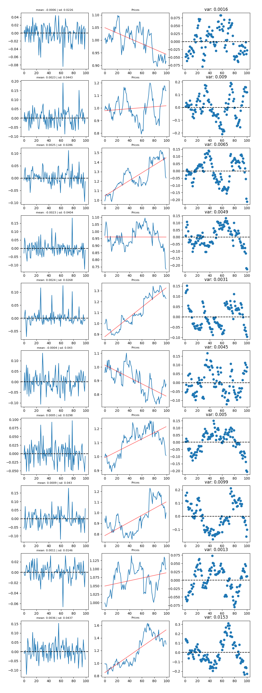

# GANs for financial series generation
<h2>Project team:</h2>

<h4>Riccardo Bollati</h4>

<h4>Elisa Carucci</h4>

<h4>Stefan Huber</h4>

# Aim of the progect:

The aim of the project is create a GAN capable of generating realistic financial time series. The folders of the projects have the functions:

- **data**: this folder contains all the dataset and the function to download new financial series and create dataset from them.
- **evaluate model**: this folder contains some functions that can be used to evaluate the series generated by the models, plotting some samples and the distribution of the series generated.
- **report**: this folder contains the pdf report that illustrates the aim of the progect and how the function used work.

# Download the data:

to donwload the data use the code contained in the data folder

# Results
the following plot illustrates some series, obtained after the scaling and application of the filter to a syntetic dataset generated by our model. The plots in the middle are the prices along with the returns that generated them on the left. The plots on the rights are the residuals obtained after a linear regression performed on the prices. The residuals plot can give some useful insights on how to tune the filter parameters based on our needs.

