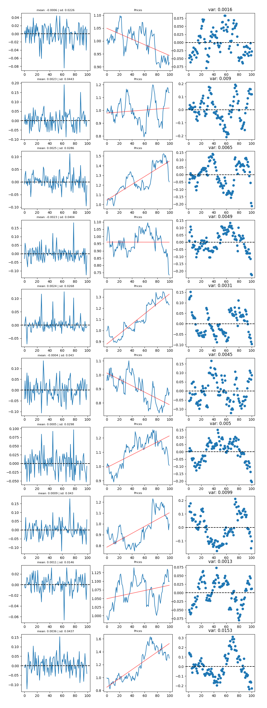
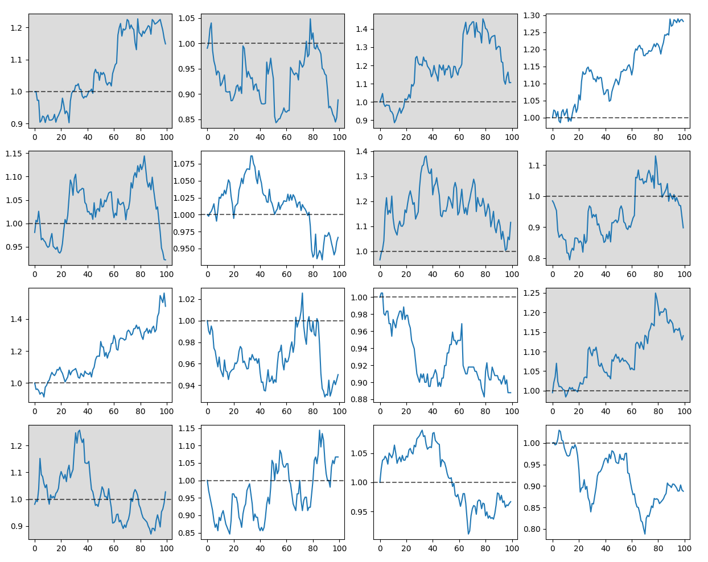

# GANs for financial series generation
<h2>Project team:</h2>

<h4>Riccardo Bollati</h4>

<h4>Elisa Carucci</h4>

<h4>Stefan Huber</h4>

# Introduction:
Given the issue of limited real usable data for quantitative research purposes, we successfully addressed the problem by simulating financial time series. We introduce the Wasserstein GAN (GANs) and tested it on the value stock index of the S&P500. The GAN model produces a time-series that recovers the statistical properties of financial time-series such as the linear unpredictability, the heavy-tailed price return distribution, volatility clustering, leverage effects, the coarse-fine volatility correlation, and the gain/loss asymmetry. 

# Aim of the progect:

The aim of the project is to create a GAN capable of generating realistic financial time series. The folders are divided in:

- **data**: This folder contains all the dataset and the python codes to download new financial series and convert them in datasets to use.
- **evaluate model**: This folder contains some functions that can be used to evaluate the series generated by the models, plotting samples and the distribution of the series generated.
- **report**: This folder contains the report divided in chapters: Introduction, progress, .....

# Download the data:

To donwload the data, it is possible to use the code contained in the folder "data". The functions to download the dataset from yahoo are in the file:  real_data_gen.ipynb. To give it a try, divide the series into windows and save them. The last function in the file is used to clean the dataset to avoid any possible error due to windows len.

# Model Architechture:

Regarding model choice, we opt for a Wasserstein GAN (WGAN) because of its strength in training stability and the fact that its loss directly correlates with the generator’s convergence. For the architecture of both generator and critic, we derive major inspiration from [Savasta & Politano(2020)](https://towardsdatascience.com/generating-synthetic-financial-time-series-with-wgans-e03596eb7185), but modify it to fit our needs:

1. The Generator is a convolutional network consisting of a sequence of convolutional, upsampling, and dropout layers followed by a linear transformation. The network applies a leaky ReLU activation function element-wise after each convolutional and linear layer, except for the final layer. The dimensions of the output are modified by applying an AddDimension and SqueezeDimension function. The network is initialized with Xavier uniform weight initialization.
2. The Critic is a convolutional network consisting of a sequence of convolutional, max pooling, and linear layers followed by a leaky ReLU activation function applied element-wise after each convolutional and linear layer. It applies spectral normalization to the output of each convolutional layer. The dimensions of the input are modified by applying an AddDimension function, and the output is flattened before the final linear layer. The final output is a single number that represents the prediction over the given sample, as fake of real.

# Results:
The following plots illustrate some series obtained from the model, after the scaling factor was applied. We apply a filter to the syntetic dataset generated by our model. This method is explained in the report folder: scaler file. The plots in the middle are the prices along with the returns, generated on the left. The plots on the rights are the residuals obtained after a linear regression performed on the prices. The plots of the residuals can give some useful insights on how to tune the filter parameters based on our needs.

The following plots shows some reale series from the dataset (white background) along with some from a fake dataset (gray background)

